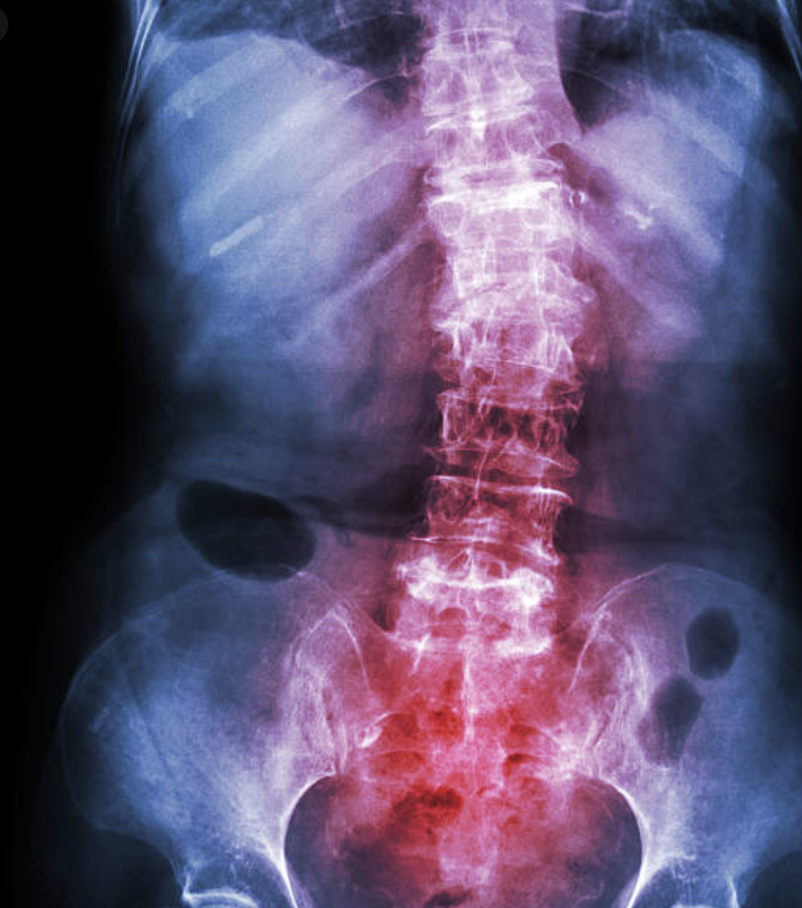

Data Science Capstone: Classification of Spondylolisthesis
========================================================
author: Michelle Ide
date:  March 2021

  
  <b><h3 style="font-size: 11">The Code:</b> Is contained in 2 notebooks for this project:</h1>

<a href="https://github.com/mishide/Springboard/blob/master/Capstone_1/scripts/Spondylo_Classification_EDA.ipynb" target="_blank">EDA</a> and
<a href="https://github.com/mishide/Springboard/blob/master/Capstone_1/scripts/Spondlyo_Classification_Models.ipynb" target="_blank">Machine Learning Models</a>.
 

   
 <b>EDA:</b> performs the cleaning and initial statistical analysis 
<b> Machine Learning Models:</b> 1) builds and tests the models 2) reviews results & recommendations</li></ol>

 
 

Why
========================================================

<small>
Spondylolisthesis is a slipped vertebra in the spine.  Early intervention is less costly, potentially avoiding major surgery and long term lifestyle changes.  Some degree of Spondylolisthesis is expected, in these 'boundry' cases, determination of "Abnormal" versus "Normal" is difficult.  
   The Spine Journal reported a study in April 2017 (1) found "miss" rates in of Lumbar MRI results to be 46%.  The results stated, 
  <i>"This study found marked variability in the reported interpretive findings and a high prevalence of interpretive errors in radiologists' reports. Findings pointed to the variability of interpretation and states "As a result, the authors conclude that where a patient obtains his or her MRI examination and which radiologist interprets the examination may have a direct impact on radiological diagnosis, subsequent choice of treatment, and clinical outcome."</i>
 
  Radiologist must compare multiple angles simultaneously to determine correct results.  Machine learning models are well suited for such simultaneous comparisons.  Gathering the experience of physicians that are contained in the data from previous results, machine learning models can learn to recognize and label results quickly, consistently, alerting radiologists to potential conflicts with their findings.  This validation system can result in reducing the costs of human validation, reduce costs with fewer lawsuits through consistent findings, and resulting in improved patient outcomes.

Project
========================================================

<small>This project creates a predictive machine to label lumbar x-ray results as "Abnormal" or "Normal' in cases of Spondylolisthesis.  It ingests 6 quantitative measurements to determine the results using the predictive model created.  This model will result in a reduced error rate, improving consistency, and can be used as an initial sorting or secondary validation system.  As the model continues to train on new data, from various Radiological results, I expect the algorithm to imrove and develop into a system that can be relied on as accurate with only the occassional need for human input.
</small> 

Data
========================================================

<small>
The data for this project was gathered from Kaggle's collection in csv format.** Originally containing 310 records prior to statistical analysis, 309 after. The data is clean and contains no null values.  It included a class label of Abnormal or Normal for each record and 6 quantitative variables
</small><small>

* Pelvic Tilt
* Pelvic Incidence
* Pelvic Radius
* Lumbar Lardosis Angle
* Sacral Slope
* Degree Spondylolisthesis.</small>

Statistical Analysis
========================================================
<small>
Total of 309 Patient Records were used (1 outlier was removed)
 
209 Abnormal, 100 Normal results
 </small> 
 
 <small>
Tukey's Method with a z-score of 2 identified three potential outliers, only 1 was removed, the other 2 were still within 99% confidence range.  
 </small>   

Modeling
========================================================
<small>To address this imbalance the train-test split was stratified to ensure identical proportions within the split.  The test data split contained 30% of the population.

Several methods of oversampling were performed on the minority class (normal). Initially, oversampling methods SMOTE and ADASYN were tested.  While SMOTE creates synthetic data points from the minority class at random, ADASYN adds weight to the boundary cases which are of importance to this project.  However, due to research performed by  'Santos, Soares, Abreu, Araujo"* in 2018 I choose to add SMOTE-TL due to it's superior performance when compared to SMOTE and the potential for ADASYN's weighting measure, the benefit we seek to balance the minority data, can also adds weight to noisy data skewing the results toward the majority.  All oversampling methods were performed inside cross-validation to prevent overly-optomistic estimates.  
K-Fold validation of five was used during hyper parameter tuning to avoid overfitting. </small> 

Results
========================================================
<small>Three of the models performed comparably well.  Logistic Regression had the top accuracy score of 91% with the Gradient Boosting Classifier and Support Vector Machine coming in second at 86%, just 5% less. </small> 

References
========================================================
Ref 1:  https://www.sciencedirect.com/science/article/pii/S1529943016310932
